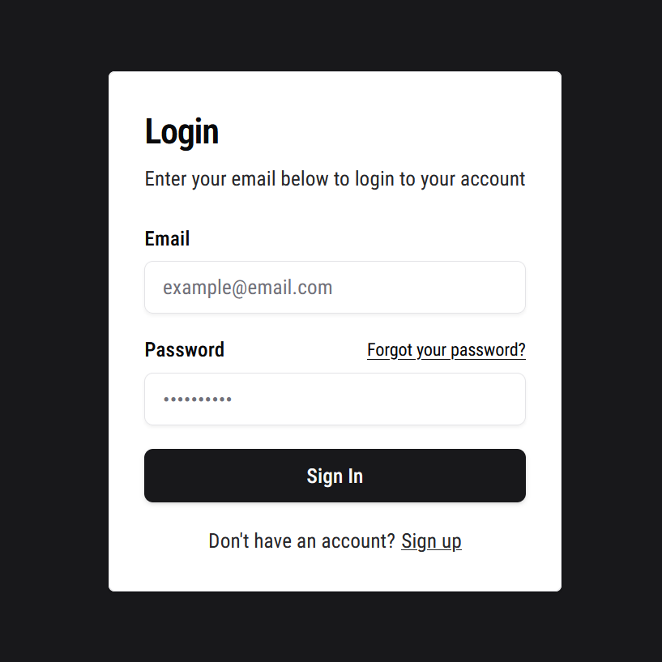
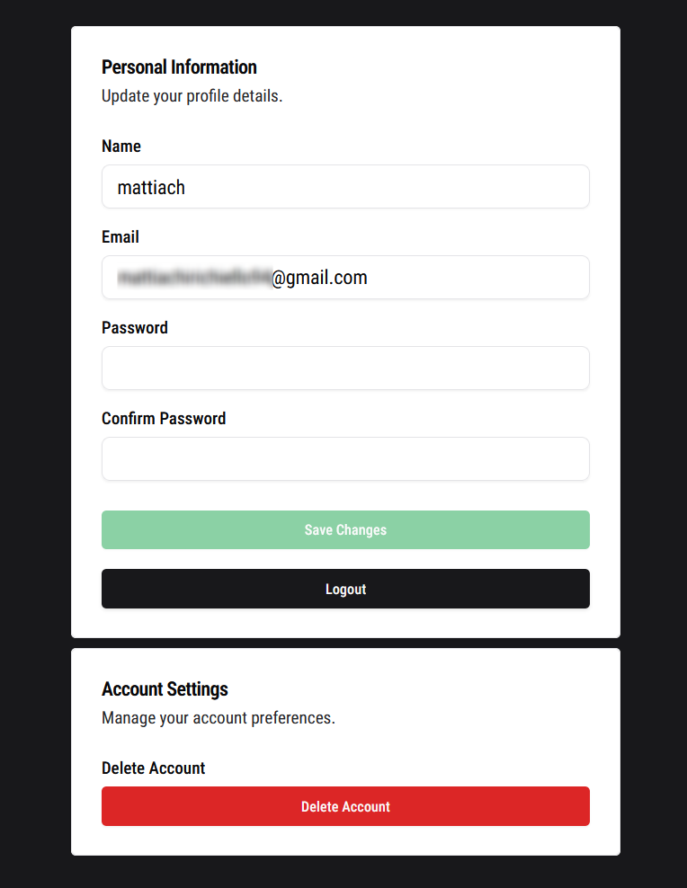
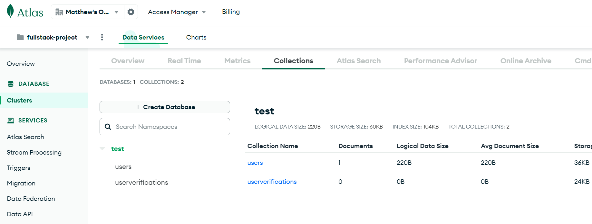
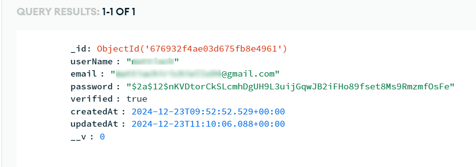
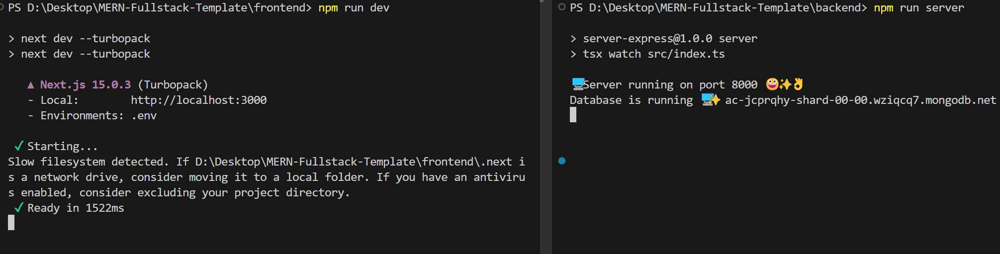
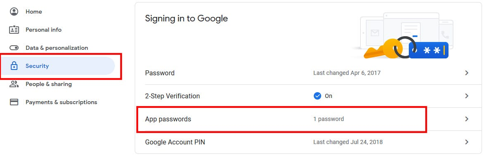

# MERN Fullstack Authentication - Boilerplate

## Description
Kickstart your _MERN stack_ (**MonboDB, Express.js, React.js, Node.js**) journey with this powerful fullstack template and build amazing apps in no time! It includes a fully implemented authentication system with _login, logout, sign-up, email verification, and password reset via email link_.

<div>
  
   
</div>

## Features

- **Fullstack Authentication System** 🔒 
  - Login  
  - Sign-up  
  - Logout  
  - Delete account  
  - Update profile details  
  - Account verification through email link  
  - Forgot password page  
  - JWT tokens stored in cookies  
  - Protected Routes  

- **Type checking with TypeScript on both client and server** ✅

- **Reusable Components** ♻️

- **Built-in features from Next.js⚡**
  - HTML & CSS minification  
  - App Router Support
  - Live reload  
  - SEO-friendly 
  - Minimalistic code  
  - Easy customization

## Dependencies Installation and Node Modules

Make sure you already have [Node js](https://nodejs.org/it/download/) installed before proceeding. Then, install the necessary node modules to start the application

```
  cd backend
  npm install
```
```
  cd frontend
  npm install
```

## .env File and MongoDB configuration
Log into your MongoDB account, or create a new one if you haven’t already, and create a Database 




## How to run the application

After installing all the necessary dependencies, you can now proceed with launching the application using the command:

```
  cd backend
  npm run server
```
Open a new terminal and run the frontend alongside the backend. I recommend starting with the backend to allow the database enough time to connect properly
```
  cd frontend
  npm run dev
```



Connect to [http://localhost:3000/](http://localhost:3000) to view the application. The API endpoints will be available at [http://localhost:8000/](http://localhost:8000)

## Sending Emails with Node.js and Gmail using Nodemailer: A Step-by-Step [Guide](https://medium.com/@pratik_shrestha/sending-emails-with-node-js-and-gmail-using-nodemailer-a-step-by-step-guide-29fa8fcc6ed6) 🚀




1. Create a Gmail account if you don’t have one. Additionally, enable two-step verification on your Google Account to generate an App Password. 🔐

2. Visit the Google Account management page by navigating to https://myaccount.google.com/.

3. Sign in to the Google Account associated with the Gmail address you want to use for sending emails programmatically.

4. In the left sidebar, click on “Security.”

5. Scroll down to “How you sign in to Google” and click on “2-step verification.”

6. Scroll down to “App passwords.” Click on “App passwords.” You may be prompted to re-enter your password for security purposes.

7. Enter a custom name for this App Password, related to the application or use case where you plan to use this App Password.

8. Click the “Create” button. Google will generate a unique 16-character App Password for your custom application/device. 🔐


## Front End: Technologies

- React js
- Next js
- Tailwind CSS, Shadcn UI
- Redux Toolkit
- eslint
- [react-amazing-hooks](https://github.com/mattiach/react-amazing-hooks) 👈🏻 made with love by me! 😄
- js-cookie, tailwind-merge, and many other JS libraries..

## Back End: Technologies

- Node.js
- Express.js
- MongoDB
- TypeScript
- Nodemailer
- dotenv, bcryptjs, express-async-handler, jsonwebtokeb, uuid, cookies-parser..


## Author and rights

Designed and written by [Mattia](https://www.linkedin.com/in/mattiach/).

The application can be downloaded and freely modified by anyone! 😊
Any suggestions or improvements will be appreciated.